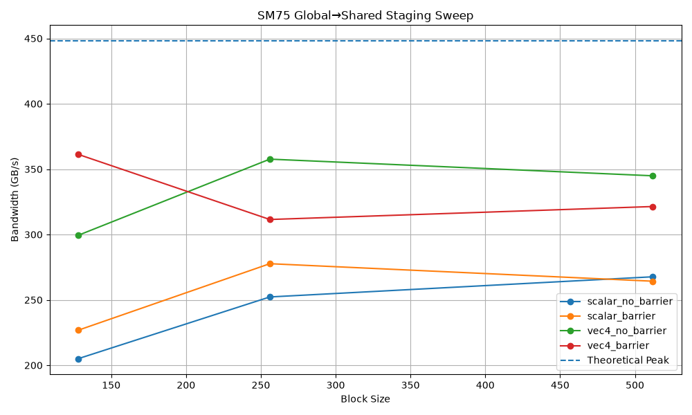
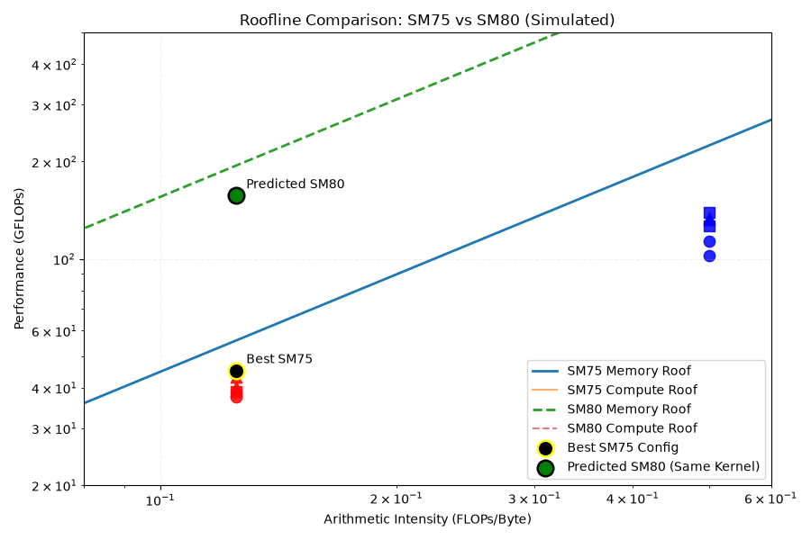

# 🚀 SM75 Global→Shared Staging Microbenchmark

[]()
[]()
[]()
[]()
[]()

> A structured microarchitectural study of memory-bound kernels on NVIDIA Turing (SM75).

---

## 📌 Overview

This project investigates how **vectorization, synchronization, and block size**
interact with GPU hardware limits on **RTX 2070 (SM75)**.

It explores:

- Scalar vs `float4` vectorized loads
- Block size sweep (128 / 256 / 512)
- `__syncthreads()` effects
- Latency hiding behavior
- Roofline-based architectural modeling
- Cross-generation scaling (SM75 → SM80 simulation)

This is a reproducible, architecture-driven performance study.

---

## 🔬 Experimental Setup

| Parameter | Value |
|------------|--------|
| GPU | RTX 2070 |
| Architecture | SM75 |
| Bandwidth | 448 GB/s |
| FP32 Peak | 7.5 TFLOPs |
| Dataset | 67M floats (~268MB) |
| Iterations | 50 per config |

---

## 📊 Bandwidth Sweep



### ✅ Key Observations

- `float4` vectorization dramatically improves bandwidth utilization
- Synchronization can *improve* performance (warp interleaving effect)
- Block size interacts non-linearly with barriers
- Manual software double buffering fails on SM75

**Best configuration:**
vec4 + barrier + BLOCK=512
≈ 350 GB/s
≈ 78% of theoretical peak

---

## 📈 Roofline Analysis



### Arithmetic Intensity

| Mode   | AI (FLOPs/Byte) |
|--------|------------------|
| scalar | 0.5 |
| vec4   | 0.125 |

All configurations are strictly memory-bound.

Measured points align closely with the SM75 memory roof.

---

## 🔄 Architectural Scaling (SM80 Simulation)

Simulated SM80 (A100-like):

| Architecture | Bandwidth | FP32 Peak |
|--------------|-----------|-----------|
| SM80 | 1555 GB/s | 19.5 TFLOPs |

Predicted performance for best kernel:
≈ 194 GFLOPs
≈ 4.4× SM75 performance

This demonstrates:

- Kernel is hardware-limited
- Bandwidth scaling dominates
- Architectural improvements shift the roofline

---

## 🧠 Architectural Insights

For low arithmetic intensity workloads:

- Memory bandwidth is the limiting factor
- Vectorization improves transaction efficiency
- Warp scheduling affects latency hiding
- Synchronization can indirectly increase throughput
- Roofline modeling accurately predicts behavior

---

## 🛠 Reproducibility

### Build

```bash
mkdir build
cd build
cmake ..
make -j
Run Benchmark
./bench > results.csv

Generate Plots
source venv/bin/activate
python scripts/plot.py
python scripts/roofline_refined.py

📂 Project Structure
cp-async-microbench/
│
├── src/
│   └── main.cu
│
├── scripts/
│   ├── plot.py
│   └── roofline_refined.py
│
├── results/
│   ├── raw/
│   └── plots/
│
└── README.md

🎯 Why This Project Matters
This repository demonstrates:

Practical GPU performance engineering
Microarchitectural reasoning
Roofline-driven optimization analysis
Cross-generation performance interpretation
This is not a toy example — it is a structured performance study.

🔮 Future Work
Implement SM80 cp.async version
Add Nsight stall analysis
Add ILP sweep automation
Add full roofline with hardware counters
Compare shared vs register-only streaming
Expand to SM90 TMA theory
📌 Takeaway
When arithmetic intensity is low, memory bandwidth defines reality.

Optimizing compute is irrelevant if you're pinned to the memory roof.

👤 Author João Felipe De Souza
Performance engineering study focused on GPU microarchitecture.

📄 License
MIT